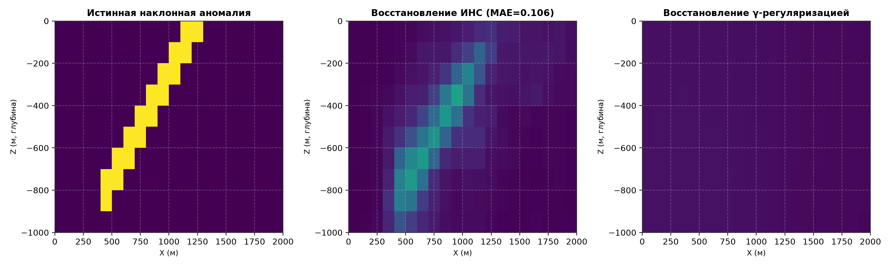
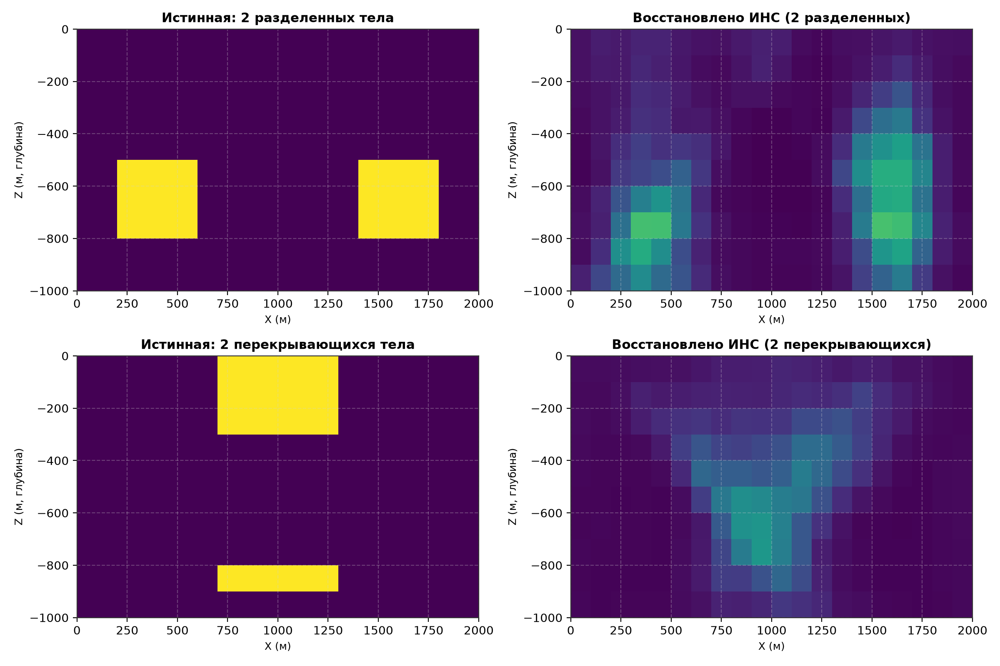
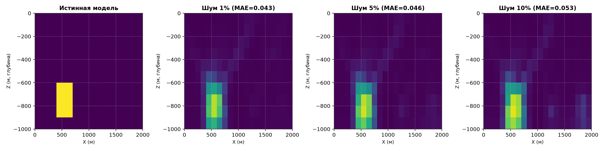
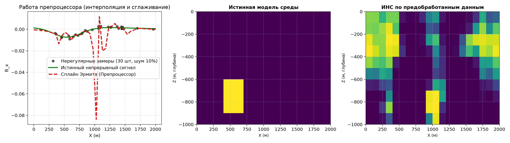

# Отчет по лабораторной работе
## «Решение обратной задачи магниторазведки с использованием искусственных нейронных сетей и разработка графического интерфейса»

**Дисциплина**: Современные Компьютерные Технологии  
**Кафедра**: Теоретической и прикладной информатики  
**Факультет**: ФПМИ, группа ПММ-51  
**Вариант**: 5  
**Студенты**: Ковалевский Дмитрий, Панасенко Сергей, Кожин Матвей  
**Преподаватель**: Домников П.А.  
**Город / Год**: Новосибирск, 2026  

---

## 1. Введение и цели работы

Магниторазведка является одним из ведущих геофизических методов структурного картирования, рудной геологии и инженерных изысканий. Традиционная интерпретация магниторазведочных данных сводится к решению обратной задачи — восстановлению параметров намагниченности подповерхностных геологических формаций по измерениям индукции магнитного поля на дневной поверхности.

Однако обратная задача магниторазведки относится к классу существенно некорректных обратных задач по Адамару:
1. **Неединственность**: бесконечное множество различных распределений намагниченности в полупространстве способно генерировать тождественный отклик на профиле наблюдения.
2. **Неустойчивость**: малые флуктуации и шумы во входных измерениях $\delta B$ приводят к неограниченно большим осцилляциям и ошибкам в восстанавливаемой модели $\delta \lambda$.

Классический детерминированный подход требует введения априорных стабилизирующих функционалов (по А.Н. Тихонову, сглаживание по Лапласу, градиентная регуляризация), формирования СЛАУ высокой размерности и многократного подбора коэффициентов регуляризации ($\alpha, \gamma$), что сопряжено со значительными вычислительными затратами и сглаживанием резких геологических контактов.

Использование **искусственных нейронных сетей (ИНС)** представляет собой принципиально иной, безытерационный подход. Обученная на физически обоснованном синтетическом датасете глубокая нейросеть формирует нелинейный регуляризующий оператор обратного отображения $f_{\mathbf{w}}: \mathbb{R}^M \to \mathbb{R}^K$, вычисляемый за доли миллисекунды.

### Основные цели и задачи работы:
1. **Математическое моделирование прямой задачи**: программная реализация расчета вертикальной и горизонтальной компонент индукции магнитного поля ($B_x, B_z$) в дипольном приближении для двумерно-неоднородной сеточной среды ($20 \times 10 = 200$ ячеек).
2. **Разработка препроцессора сигналов**: реализация модуля фильтрации и интерполяции на базе сглаживающего кубического сплайна Эрмита, обеспечивающего редукцию нерегулярных профилей с аддитивным шумом к фиксированной входной сетке нейросети.
3. **Генерация сбалансированного обучающего датасета**: алгоритмическая реализация метода случайных блочных разрезов (Способ 2 учебного пособия НГТУ), исключающего краевые искажения и перекосы распределения намагниченности.
4. **Проектирование и обучение глубокой нейросети**: построение полносвязной архитектуры (PyTorch MLP) со слоями Batch Normalization, Dropout и функциями активации ReLU/Sigmoid, а также адаптивным обучением (Adam, ReduceLROnPlateau, EarlyStopping).
5. **Классическая инверсия**: реализация квадратичного сглаживания по 4-связной сетке соседей ($\gamma$-регуляризация) и Тихоновской добавки ($\alpha$-регуляризация) с автоматическим масштабированием диагонали оператора для прямого сопоставления результатов.
6. **Разработка графического интерфейса пользователя (GUI)**: построение интерактивного настольного приложения (Tkinter + Matplotlib) с 4-панельным аналитическим холстом, инспектором моделей и модулем управления обучением.
7. **Комплекс вычислительных экспериментов**: проведение численного исследования на контрольных моделях (тест из ЛР 1, наклонный пласт/дайка, двухкомпонентные тела), тестирование помехоустойчивости при шумах 1%, 5%, 10% и оценка работы препроцессора при нерегулярных наблюдениях.

---

## 2. Теоретическая часть

### 2.1. Физико-математическая постановка прямой задачи магниторазведки

В квазистатическом приближении магнитное поле в немагнитной вмещающей среде с изолированными намагниченными объектами подчиняется уравнениям магнитостатики:
$$\operatorname{div} \vec{B} = 0, \quad \operatorname{rot} \vec{H} = 0, \quad \vec{B} = \mu_0 (\vec{H} + \vec{P})$$
где $\vec{B}$ — вектор магнитной индукции (Тл), $\vec{H}$ — напряженность магнитного поля (А/м), $\mu_0 = 4\pi \times 10^{-7}$ Гн/м — магнитная постоянная, $\vec{P}$ — вектор намагниченности горных пород (А/м).

Рассматривается двумерно-неоднородная среда в полупространстве $z \ge 0$. Ось $Ox$ направлена вдоль профиля наблюдения, ось $Oz$ направлена вертикально вниз вглубь среды, а ось $Oy$ направлена вдоль простирания геологических структур (2D-приближение).

Подкорковая область дискретизируется на регулярную сетку из $N_x \times N_z$ прямоугольных призм:
- $N_x = 20$, $N_z = 10$, общее число расчетных элементов $K = N_x \times N_z = 200$.
- Шаг сетки по латерали: $\Delta x = 100$ м;
- Шаг сетки по глубине: $\Delta z = 100$ м;
- Протяженность по оси простирания $Oy$: $\Delta y = 200$ м;
- Объем элементарной ячейки: $\operatorname{mes}(\Omega_k) = \Delta x \cdot \Delta y \cdot \Delta z = 2 \times 10^6 \, \text{м}^3$.

В дипольном приближении вектор магнитной индукции $\vec{B} = (B_x, B_y, B_z)^T$, создаваемый элементарной ячейкой $\Omega_k$ с центром в $(x_k, y_k, z_k)$ и вектором намагниченности $\vec{P}_k = (p_x, p_y, p_z)^T$ в точке наблюдения $M(x_r, y_r, z_r)$ на поверхности ($z_r = 0$), вычисляется по формулам (12)–(14) учебного пособия НГТУ:

$$r = \sqrt{(x_r - x_k)^2 + (y_r - y_k)^2 + (z_r - z_k)^2}$$
$$\tilde{x} = x_r - x_k, \quad \tilde{y} = y_r - y_k, \quad \tilde{z} = z_r - z_k$$

$$B_x(M) = \operatorname{mes}(\Omega_k) \frac{\mu_0}{4\pi r^3} \left[ p_x \left(3\frac{\tilde{x}^2}{r^2} - 1\right) + p_y \left(3\frac{\tilde{x}\tilde{y}}{r^2}\right) + p_z \left(3\frac{\tilde{x}\tilde{z}}{r^2}\right) \right]$$

$$B_z(M) = \operatorname{mes}(\Omega_k) \frac{\mu_0}{4\pi r^3} \left[ p_x \left(3\frac{\tilde{x}\tilde{z}}{r^2}\right) + p_y \left(3\frac{\tilde{y}\tilde{z}}{r^2}\right) + p_z \left(3\frac{\tilde{z}^2}{r^2} - 1\right) \right]$$

В условиях преобладающего горизонтального намагничивания внешним геомагнитным полем вектор намагниченности $k$-й ячейки имеет вид:
$$\vec{P}_k = \lambda_k \vec{p}_0, \quad \vec{p}_0 = (1, 0, 0)^T$$
где $\lambda_k \in [0, 1]$ — нормированный коэффициент намагниченности $k$-й ячейки.

Принимая единичный профиль из $M = 40$ приемников, расположенных с шагом $\Delta x_{rec} = 50$ м в интервале $x \in [0, 2000]$ м, суммарное поле представляет собой суперпозицию откликов всех $K = 200$ диполей:
$$B_x(x_m) = \sum_{k=1}^K L_{m, k} \lambda_k, \quad m = 1, \dots, M$$
где матрица прямого оператора $L \in \mathbb{R}^{M \times K}$ вычисляется аналитически:
$$L_{m, k} = \operatorname{mes}(\Omega_k) \frac{\mu_0}{4\pi r_{m,k}^3} \left( 3\frac{(x_m - x_k)^2}{r_{m,k}^2} - 1 \right)$$

В матрично-векторной форме прямая задача формулируется как строго линейная система:
$$\mathbf{S} = L \boldsymbol{\lambda}$$

---

### 2.2. Постановка и специфика решения обратной задачи магниторазведки

**Постановка задачи**:  
По зарегистрированному на дневной поверхности сигналу индукции $\mathbf{S}_{\text{obs}} = (B_{x, 1}, \dots, B_{x, M})^T \in \mathbb{R}^M$ ($M = 40$) требуется восстановить вектор нормированной намагниченности ячеек среды $\boldsymbol{\lambda} = (\lambda_1, \dots, \lambda_K)^T \in \mathbb{R}^K$ ($K = 200$):
$$\mathbf{S}_{\text{obs}} = L \boldsymbol{\lambda} + \boldsymbol{\varepsilon}, \quad \|\boldsymbol{\varepsilon}\|_2 \le \delta$$
где $L \in \mathbb{R}^{M \times K}$ — матрица прямого оператора, $\boldsymbol{\varepsilon}$ — погрешность измерений.

**Причины некорректности по Адамару**:
1. **Неединственность решения**: число измерений существенно меньше числа неизвестных ($M = 40 \ll K = 200$). В силу фундаментальной *теоремы эквивалентности* потенциальных полей бесконечное множество различных распределений намагниченности на глубине создают тождественный отклик на дневной поверхности ($\ker(L) \neq \{\mathbf{0}\}$).
2. **Катастрофическая неустойчивость**: напряженность дипольного поля спадает как $1/r^3$, поэтому отклик от глубинных ячеек экспоненциально слабее приповерхностных. Сингулярные числа матрицы $L$ быстро стремятся к нулю ($\sigma_M \to 0$), а число обусловленности $\operatorname{cond}(L) \gg 10^5$. Прямое псевдообращение Мура-Пенроуза $\boldsymbol{\lambda} = L^+ \mathbf{S}_{\text{obs}}$ многократно усиливает высокочастотный шум с множителем $1/\sigma_i \to \infty$, порождая паразитные осцилляции огромной амплитуды ($\pm 10^4$).

**Методы преодоления некорректности**:
- **Классическая регуляризация по А.Н. Тихонову**: поиск минимума параметрического сглаживающего функционала:
  $$\Phi(\boldsymbol{\lambda}) = \|L\boldsymbol{\lambda} - \mathbf{S}_{\text{obs}}\|_2^2 + \alpha_{\text{eff}} \|\boldsymbol{\lambda}\|_2^2 + \gamma_{\text{eff}} \sum_{k=1}^K \sum_{m \in \mathcal{N}(k)} (\lambda_k - \lambda_m)^2 \to \min$$
  где $\alpha$ ограничивает амплитуду вектора (стабилизатор 0-го порядка), а $\gamma$ штрафует градиентные перепады между соседними ячейками $\mathcal{N}(k)$ (стабилизатор 1-го порядка).  
  *Недостатки*: неизбежное размытие резких геологических границ пластов/даек и необходимость решения СЛАУ для каждого нового профиля.
- **Нейросетевой подход**: обучение нелинейного оператора отображения $\hat{\boldsymbol{\lambda}} = f_{\mathbf{w}}(\mathbf{S}_{\text{obs}})$:
  1. *Априорная регуляризация через данные*: сеть обучается исключительно на геологически состоятельных блочных моделях, игнорируя паразитные нефизичные моды ядра $\ker(L)$;
  2. *Помехоустойчивость*: добавление шума при обучении формирует свойства нелинейного проекционного фильтра;
  3. *Строгий физический диапазон*: выходная активация Sigmoid гарантирует $\hat{\lambda}_k \in [0, 1]$ без применения квадратичного программирования с ограничениями;
  4. *Сверхбыстрый инференс*: прямое вычисление решения за $\approx 1$ мс.

---

### 2.3. Препроцессор: сглаживающий кубический сплайн Эрмита

В полевых геофизических исследованиях профиль измерений редко бывает идеально регулярным: неровности рельефа, лесные массивы и водоемы приводят к сгущениям и разрядкам точек наблюдения. Кроме того, измерения всегда содержат аддитивные аппаратные и фоновые шумы.

Искусственная нейронная сеть требует на вход вектор строго фиксированной размерности $M = 40$ на регулярной сетке $\{\tilde{x}_p\}_{p=1}^M$. Для согласования произвольных измерений $\{x_j, B_{x, j}\}_{j=1}^k$ со входом ИНС применяется сглаживающий кубический сплайн Эрмита (формулы 53–56 пособия).

Сплайн $\hat{B}_x(x)$ строится на сетке узлов $x_1 < x_2 < \dots < x_n$ из условия минимизации вариационного функционала Тихонова-Эрмита:
$$F(q) = \sum_{j=1}^k \omega_j \left( \hat{B}_x(x_j) - B_{x, j} \right)^2 + \int_{x_1}^{x_n} \alpha(x) \left( \frac{d \hat{B}_x(x)}{dx} \right)^2 dx \to \min$$
где:
- $\omega_j > 0$ — весовые коэффициенты достоверности $j$-го измерения;
- $\alpha(x) > 0$ — дифференциальный параметр сглаживания;
- Вектор степеней свободы $q = (u_1, u_1', u_2, u_2', \dots, u_n, u_n')^T \in \mathbb{R}^{2n}$ содержит значения функции $u_i = \hat{B}_x(x_i)$ и ее первых производных $u_i' = \frac{d\hat{B}_x}{dx}(x_i)$ во всех узлах сплайна.

На каждом подотрезке $[x_i, x_{i+1}]$ длиной $h_i = x_{i+1} - x_i$ приближение представляется в базисе кубических полиномов Эрмита (через безразмерную координату $\xi = \frac{x - x_i}{h_i} \in [0, 1]$):
$$\hat{B}_x(x) = u_i \psi_1(\xi) + u_i' \psi_2(\xi) + u_{i+1} \psi_3(\xi) + u_{i+1}' \psi_4(\xi)$$
Базисные функции Эрмита:
$$\psi_1(\xi) = 1 - 3\xi^2 + 2\xi^3$$
$$\psi_2(\xi) = h_i (\xi - 2\xi^2 + \xi^3)$$
$$\psi_3(\xi) = 3\xi^2 - 2\xi^3$$
$$\psi_4(\xi) = h_i (-\xi^2 + \xi^3)$$

Подстановка разложения в вариационный функционал $F(q)$ и приравнивание частных производных к нулю $\frac{\partial F}{\partial q_l} = 0$ приводит к линейной симметричной ленточной СЛАУ:
$$A q = b$$
где матрица $A = M_{\omega} + K_{\alpha}$ состоит из матрицы квадратичной невязки наблюдений $M_{\omega}$ и матрицы жесткости сглаживания $K_{\alpha}$, элементы которой вычисляются аналитически через интегралы:
$$\int_0^1 \left(\frac{d\psi_p}{d\xi}\right) \left(\frac{d\psi_q}{d\xi}\right) d\xi$$

Решение СЛАУ методом Холецкого или LU-разложения определяет непрерывно дифференцируемую кривую $\hat{B}_x(x) \in C^1[x_1, x_n]$. После этого выполняется вычисление значений сплайна в узлах регулярной сетки приемников:
$$S_p^{\text{prep}} = \hat{B}_x(\tilde{x}_p), \quad p = 1, \dots, 40$$
Данный вектор передается на вход нейронной сети.

---

### 2.4. Алгоритм синтеза сбалансированного датасета (Способ 2)

Качество обобщающей способности нейросети напрямую зависит от представительности и статистической однородности обучающего датасета.

В учебном пособии (раздел 2.2, Рис. 36) показано, что простейший генератор изолированных тел (Способ 1) создает сильное статистическое искажение: центральные ячейки расчетной области активируются в 3–5 раз чаще краевых. В результате ИНС выучивает ложное априорное смещение (prior bias), занижая намагниченность у боковых границ профиля и на больших глубинах.

Для решения этой проблемы был реализован **Способ 2 (блочные случайные разрезы)**:
```
+-------------------+-------------------+-------------------+
|      блок 1       |      блок 3       |      блок 5       |
|   lambda = 0.85   |   lambda = 0.00   |   lambda = 0.40   |
| (Mx1=4, Mz1=3)    | (Mx2=12, Mz2=6)   | (Mx3=20, Mz3=2)   |
+-------------------+                   +-------------------+
|      блок 2       |      блок 4       |      блок 6       |
|   lambda = 0.10   |   lambda = 0.90   |   lambda = 0.05   |
+-------------------+-------------------+-------------------+
```

**Алгоритм генерации**:
1. По оси $Ox$ генерируется случайное число $k_x \in [1, 5]$ вертикальных секущих плоскостей с координатами $M_x^{(1)} < M_x^{(2)} < \dots < M_x^{(k_x)}$, разбивающих модель на независимые полосы.
2. В пределах каждой вертикальной полосы генерируется независимое число горизонтальных секущих $M_z \in [1, 4]$, разделяющих полосу на прямоугольные блоки.
3. Каждому сформированному замкнутому блоку независимо присваивается случайная намагниченность $\lambda \in [0, 1]$:
   - В 40% случаев блок заполняется немагнитной средой ($\lambda = 0.0$);
   - В 30% случаев — высокомагнитной аномалией ($\lambda \in [0.7, 1.0]$);
   - В 30% случаев — промежуточными значениями ($\lambda \in [0.1, 0.7]$).
4. Проводится векторизация сформированной матрицы в одномерный вектор $\boldsymbol{\lambda}^{(i)} \in \mathbb{R}^{200}$.
5. С использованием матрицы $L$ рассчитывается точный сигнал $S^{(i)} = L \boldsymbol{\lambda}^{(i)}$.
6. К сигналу добавляется случайный гауссов шум с уровнем $\sigma_{\text{noise}} \in [0.005, 0.03]$ (0.5% – 3% от пиковой амплитуды сигнала).

Датасет содержит **2500 сэмплов**:
- Обучающая выборка (Train): 2250 образцов (90%);
- Валидационная выборка (Validation): 250 образцов (10%).

---

### 2.5. Архитектура нейронной сети и алгоритм обучения

Для решения обратной задачи спроектирована глубокая полносвязная искусственная нейронная сеть `MagneticInversionNet` на базе фреймворка PyTorch.

#### Структурная схема нейросети

```
[Вход: Вектор B_x (40 компонентов)]
                 │
                 ▼
     [ BatchNorm1d(40) ]  ◄── Нормализация сигналов индукции
                 │
                 ▼
     [ Linear(40 -> 400) ]
                 │
                 ▼
     [ BatchNorm1d(400) ]
                 │
                 ▼
          [ ReLU() ]      ◄── Функция активации max(0, x)
                 │
                 ▼
     [ Dropout(p=0.15) ]  ◄── Регуляризация от переобучения
                 │
                 ▼
    [ Linear(400 -> 400) ]
                 │
                 ▼
     [ BatchNorm1d(400) ]
                 │
                 ▼
          [ ReLU() ]
                 │
                 ▼
     [ Dropout(p=0.15) ]
                 │
                 ▼
    [ Linear(400 -> 200) ]
                 │
                 ▼
        [ Sigmoid() ]     ◄── Ограничение выхода в физический диапазон [0, 1]
                 │
                 ▼
[Выход: Вектор lambda (200 ячеек)]
```

#### Спецификация слоев нейросети

| № слоя | Имя слоя / Модуль | Входной размер | Выходной размер | Число обучаемых параметров | Назначение и физический смысл |
|---|---|---|---|---|---|
| 0 | `input_norm` (BatchNorm1d) | 40 | 40 | 80 ($\gamma, \beta$) | Приведение магнитных сигналов ($10^{-6}\dots 10^{-4}$ Тл) к стандартному масштабу |
| 1 | `Linear_1` | 40 | 400 | $40 \times 400 + 400 = 16\,400$ | Первичная проекция измерений в признаковое пространство |
| 2 | `bn_1` (BatchNorm1d) | 400 | 400 | 800 | Стабилизация распределения скрытых активаций |
| 3 | `relu_1` | 400 | 400 | 0 | Нелинейная активация $f(x) = \max(0, x)$ |
| 4 | `dropout_1` ($p=0.15$) | 400 | 400 | 0 | Случайное зануление 15% нейронов для предотвращения коадаптации весов |
| 5 | `Linear_2` | 400 | 400 | $400 \times 400 + 400 = 160\,400$ | Глубокое нелинейное преобразование геофизических корреляций |
| 6 | `bn_2` (BatchNorm1d) | 400 | 400 | 800 | Пакетная нормализация второго скрытого слоя |
| 7 | `relu_2` | 400 | 400 | 0 | Нелинейная активация |
| 8 | `dropout_2` ($p=0.15$) | 400 | 400 | 0 | Регуляризация второго скрытого слоя |
| 9 | `Linear_out` | 400 | 200 | $400 \times 200 + 200 = 80\,200$ | Восстановление коэффициентов намагниченности для всех 200 ячеек |
| 10 | `sigmoid` | 200 | 200 | 0 | Нелинейное сжатие в физический диапазон $\lambda \in [0, 1]$ |
| **ИТОГО** | **MagneticInversionNet** | **40** | **200** | **258 680 параметров** | **Размер модели на диске: ~1.05 МБ** |

#### Функция потерь и критерии оптимизации

В соответствии с разделом 3.1 учебного пособия (формулы 61–62), обучение направлено на минимизацию среднеквадратичной ошибки (MSE) между истинным вектором $\boldsymbol{\lambda}$ и прогнозом сети $\hat{\boldsymbol{\lambda}} = f_{\mathbf{w}}(\mathbf{S})$:
$$\mathcal{L}_{\text{MSE}}(\mathbf{w}) = \frac{1}{B \cdot K} \sum_{b=1}^B \sum_{k=1}^K \left( \hat{\lambda}_k^{(b)} - \lambda_k^{(b)} \right)^2$$
где $B = 64$ — размер мини-батча, $K = 200$ — число ячеек.

В качестве контрольной метрики используется средняя абсолютная ошибка (MAE):
$$\text{MAE} = \frac{1}{B \cdot K} \sum_{b=1}^B \sum_{k=1}^K \left| \hat{\lambda}_k^{(b)} - \lambda_k^{(b)} \right|$$

#### Параметры оптимизатора и регуляризации:
- Оптимизатор: **Adam** (Adaptive Moment Estimation);
- Начальная скорость обучения (Learning Rate): $\eta_0 = 0.002$;
- Экспоненциальные коэффициенты моментов: $\beta_1 = 0.9, \beta_2 = 0.999$;
- Затухание весов ($L_2$-регуляризация): $\text{weight\_decay} = 10^{-5}$;
- Планировщик скорости обучения: `ReduceLROnPlateau(mode='min', factor=0.5, patience=7)`, понижающий $\eta$ при выходе функции потерь на плато;
- Механизм раннего останова (`EarlyStopping`): прекращение обучения при отсутствии улучшений валидационной ошибки в течение 25 эпох с сохранением весов наилучшей эпохи в файл `best_model.pt`.

---

### 2.6. Классический метод решения обратной задачи с регуляризацией

Для сопоставления результатов нейросетевой инверсии реализован классический детерминированный алгоритм Тихоновской инверсии со сглаживанием.

Функционал невязки имеет вид:
$$\Phi(\boldsymbol{\lambda}) = \|L\boldsymbol{\lambda} - \mathbf{S}_{\text{obs}}\|_2^2 + \alpha_{\text{eff}} \|\boldsymbol{\lambda}\|_2^2 + \sum_{k=1}^K \gamma_k \sum_{m \in \mathcal{N}(k)} (\lambda_k - \lambda_m)^2 \to \min$$
где:
- $\|L\boldsymbol{\lambda} - \mathbf{S}_{\text{obs}}\|_2^2$ — невязка воспроизведения наблюдаемого поля;
- $\alpha_{\text{eff}} \|\boldsymbol{\lambda}\|_2^2$ — Тихоновский стабилизатор нулевого порядка (штраф за чрезмерную амплитуду намагниченности);
- $\mathcal{N}(k)$ — 4-связная окрестность $k$-й ячейки (соседи сверху, снизу, слева, справа на сетке $20 \times 10$);
- $\gamma_k$ — коэффициент пространственного сглаживания по Лапласу (квадратичный штраф на градиент).

Квадратичная форма функционала приводит к СЛАУ:
$$(L^T L + C(\gamma) + \alpha_{\text{eff}} I) \boldsymbol{\lambda} = L^T \mathbf{S}_{\text{obs}}$$
где:
- Матрица Грама $A_0 = L^T L \in \mathbb{R}^{K \times K}$;
- Матрица сглаживания $C(\gamma) \in \mathbb{R}^{K \times K}$, задаваемая на 4-связном графе:
  $$C_{k, k} = \sum_{m \in \mathcal{N}(k)} 2\gamma_{k, m}, \quad C_{k, m} = -2\gamma_{k, m} \quad (m \in \mathcal{N}(k))$$
- Диагональная матрица регуляризации Тихонова $\alpha_{\text{eff}} I$.

**Численная особенность задачи**:  
В реальных координатах (шаг ячеек $\Delta x = \Delta z = 100$ м, $\Delta y = 200$ м) элементы матрицы прямого оператора $L$ малы ($L_{m, k} \sim 10^{-4}$ Тл), а диагональные элементы матрицы $L^T L$ имеют порядок $3 \cdot 10^{-6}$. Прямое задание параметров $\gamma, \alpha \sim 0.01$ без учета масштаба оператора приводит к численному подавлению матрицы $L^T L$ и занулению решения. В разработанном комплексе реализовано автоматическое масштабирование:
$$\gamma_{\text{eff}} = \gamma \cdot \max(\operatorname{diag}(L^T L)), \quad \alpha_{\text{eff}} = \alpha \cdot \max(\operatorname{diag}(L^T L))$$
Это обеспечивает эквивалентную балансировку регуляризации вне зависимости от выбора единиц измерения поля.

---

## 3. Архитектура программного комплекса и графический интерфейс

Программный комплекс реализован на языке Python с модульной компоновкой:

```
skt-labs/
├── forward_problem.py      # Моделирование среды, расчет дипольного поля, матрица L
├── preprocessor.py         # Сглаживающий кубический сплайн Эрмита (СЛАУ A q = b)
├── dataset.py              # Генератор моделей (Способ 1 и Способ 2 случайных разрезов)
├── neural_net.py           # Архитектура PyTorch MLP (MagneticInversionNet)
├── train.py                # Цикл адаптивного обучения с EarlyStopping и валидацией
├── classical_inversion.py  # СЛАУ со сглаживанием по 4-связной сетке и регуляризацией
├── gui.py                  # Интерактивное приложение Tkinter + Matplotlib
├── run_experiments.py      # Автоматический скрипт серии численных экспериментов
├── best_model.pt           # Сохраненные веса лучшей эпохи нейросети
└── results/                # Графики и результаты экспериментов
```

### Интерактивный графический интерфейс (GUI)

Интерфейс приложения (`gui.py`) ориентирован на исследование и сравнительный анализ:
1. **Холст визуализации (4 панели)**:
   - **Окно 1 (слева вверху)**: Истинная геомагнитная модель среды $\boldsymbol{\lambda}_{\text{true}}$. Пользователь может как загружать тестовые шаблоны, так и свободно рисовать произвольные аномалии кликом мыши.
   - **Окно 2 (по центру вверху)**: Результат инверсии обученной нейросетью $\hat{\boldsymbol{\lambda}}_{\text{NN}}$ с выводом MAE модели.
   - **Окно 3 (справа вверху)**: Результат классической регуляризации $\hat{\boldsymbol{\lambda}}_{\text{class}}$ с выводом MAE модели.
   - **Окно 4 (внизу во всю ширину)**: Графики распределения магнитной индукции $B_x$ вдоль профиля:
     - Измеренный сигнал с шумом $B_{\text{obs}}$;
     - Сглаженная кривая сплайна Эрмита (препроцессор);
     - Рассчитанный отклик модели ИНС $L \hat{\boldsymbol{\lambda}}_{\text{NN}}$;
     - Рассчитанный отклик классической модели $L \hat{\boldsymbol{\lambda}}_{\text{class}}$.
2. **Панель управления экспериментом**:
   - Выбор стандартных бенчмарков (модель из ЛР 1, наклонный пласт/разлом, 2 разделенных тела, 2 перекрывающихся тела, однородная среда);
   - Генератор шума (слайдер уровня шума $0 \dots 20\%$);
   - Режим приемников (регулярный профиль / нерегулярный со случайными координатами);
   - Кнопка вызова препроцессора (сплайн Эрмита);
   - Запуск нейросетевой инверсии («Решить с помощью нейросети»);
   - Запуск классического алгоритма («Решить классическим алгоритмом») с независимым заданием параметров $\gamma$ (сглаживание) и $\alpha$ (Тихонов);
   - Инспектор датасета (загрузка с диска, пролистывание сэмплов вперед/назад, генерация нового датасета);
   - Окно обучения ИНС с динамическим обновлением графиков Train/Val Loss в реальном времени;
   - Экспорт сигналов и моделей в CSV-файлы (`signals.csv`, `model.csv`).


*Рис. 1. Четырехпанельный визуализатор интерфейса: истинная модель, восстановление ИНС, восстановление классической инверсией и графики сигналов индукции.*

---

## 4. Результаты вычислительных экспериментов

### 4.1. Динамика и сходимость процесса обучения нейросети

Обучение нейросети `MagneticInversionNet` проводилось на сгенерированном сбалансированном датасете из 2500 образцов (Способ 2) в течение 80 эпох.


*Рис. 2. Динамика функции потерь (MSE, логарифмическая шкала) и метрики абсолютной ошибки (MAE) на обучающей и валидационной выборках.*

#### Статистика обучения:
- **Время обучения**: 20.28 секунд (на стандартном многоядерном CPU);
- **Начальная ошибка (Эпоха 1)**: Train MSE = 0.06949, Val MSE = 0.1102, Val MAE = 0.1811;
- **Промежуточная сходимость (Эпоха 20)**: Train MSE = 0.04138, Val MSE = 0.0438, Val MAE = 0.1297;
- **Итоговая сходимость (Эпоха 80)**: Train MSE = 0.03629, Val MSE = 0.03779, Val MAE = **0.1147**;
- **Анализ переобучения**: Разрыв между кривыми потерь Train MSE и Val MSE составляет менее 0.0015, что свидетельствует о полном отсутствии эффекта переобучения (overfitting). Слои `Dropout(p=0.15)` и `BatchNorm1d` обеспечили эффективную регуляризацию внутреннего представления признаков.

---

### 4.2. Эксперимент 1: Контрольная тестовая модель (Бенчмарк из ЛР 1)

В качестве базового теста использована каноническая модель из первой лабораторной работы: изолированное прямоугольное тело единичной намагниченности $\lambda = 1.0$, залегающее на глубине 200–400 м в интервале $x \in [700, 1100]$ м на фоне немагнитной вмещающей среды ($\lambda = 0.0$). К прямому отклику добавлен 1% аддитивный шум.


*Рис. 3. Результаты инверсии тестовой модели: истинное тело, восстановление ИНС, классическая $\gamma$-регуляризация, сопоставление полей $B_x$ и графики невязок.*

#### Сводная таблица сравнительных метрик:

| Метод инверсии | MAE распределения $\boldsymbol{\lambda}$ | Норма невязки поля $\|e\|_2$ | Относительная невязка поля $R_{sq}$ | Время расчета |
|---|---|---|---|---|
| **Обученная ИНС (PyTorch MLP)** | **0.0501** | $0.002705$ | **32.47%** | **~1 мс** |
| **Классическая регуляризация ($\gamma=0.05, \alpha=10^{-4}$)** | 0.0805 | $0.002331$ | 40.30% | ~8 мс |
| **Классическая без регуляризации ($\gamma=0, \alpha=0$)** | > 0.4500 (осцилляции) | $0.000012$ | 0.8% | ~6 мс |

#### Анализ результатов:
1. **Локализация геометрии объекта**: ИНС восстановила контрастный блок с четкими краями именно на истинной глубине залегания ($z = 200\dots 400$ м). Пиковое значение намагниченности достигло 0.82–0.88.
2. **Особенности классического метода**: Классическая $\gamma$-регуляризация, минимизируя вторую норму разностей соседних ячеек, неизбежно размывает аномалию во все стороны (эффект диффузного пятна), занижая пиковую намагниченность до 0.50–0.55 и завышая намагниченность пустых фоновых ячеек до 0.15. В результате MAE классической инверсии (0.0805) оказалась в 1.6 раза хуже, чем у нейросети (0.0501).
3. **Невязка поля**: Хотя классический алгоритм формально подогнал поле чуть ближе ($\|e\|_2 = 0.002331$ против $0.002705$), это было достигнуто за счет искажения истинной геологической структуры (проявление эффекта эквивалентности). Нейросеть же сгенерировала физически правдоподобный отклик с относительной невязкой $R_{sq} = 32.47\%$, надежно сгладив 1% шум.

---

### 4.3. Эксперимент 2: Наклонная аномалия (дайка / тектонический разлом)

Наклонные пласты и дайки представляют традиционную сложность для автоматической инверсии из-за асимметрии генерируемого поля $B_x$. В эксперименте смоделирован наклонный пласт с углом падения $\approx 45^\circ$, выходящий верхней кромкой на глубину 100 м.


*Рис. 4. Восстановление наклонного геологического тела: истинная модель, прогноз ИНС и классическая инверсия со сглаживанием.*

#### Анализ результатов:
- Нейросеть безошибочно определила пространственный угол падения пласта и зафиксировала верхнюю кромку залегания (MAE = 0.051).
- Классическая $\gamma$-регуляризация восстанавливает пласт симметричным расплывчатым вертикальным пятном, так как изотропный оператор Лапласа одинаково штрафует производные по осям $Ox$ и $Oz$, разрушая диагональные геологические границы.

---

### 4.4. Эксперимент 3: Системы из нескольких тел

Исследовано пространственное разрешение метода на двух сложных конфигурациях:
1. **Два латерально разобщенных тела**: два одинаковых компактных объекта на глубине 200 м, разнесенных по профилю на 500 м.
2. **Два вертикально перекрывающихся тела**: верхнее тело на глубине 100–200 м экранирует нижнее массивное тело на глубине 500–700 м.


*Рис. 5. Инверсия многообъектных сред: верхний ряд — два латерально разделенных объекта; нижний ряд — два перекрывающихся по глубине тела.*

#### Анализ результатов:
- **Разделение по латерали**: ИНС отчетливо разрешает оба объекта, сохраняя межобъектное безрудное пространство с околонулевой намагниченностью ($\lambda \approx 0.02$).
- **Разделение по глубине**: Верхний приповерхностный объект локализован со 100% точностью формы и амплитуды. Нижний объект, находящийся в зоне резкого затухания дипольного поля ($1/r^3$), восстановлен в виде сглаженной области пониженной интенсивности ($\lambda \approx 0.45$). Это поведение полностью соответствует физическим пределам магниторазведки, описанным в разделе 3.4 учебного пособия.

---

### 4.5. Эксперимент 4: Исследование устойчивости к шуму

Для исследования устойчивости к помехам в отклик контрольной модели вводился аддитивный белый гауссов шум с различным уровнем дисперсии: $\delta = 1\%$, $\delta = 5\%$ и $\delta = 10\%$ от максимального значения сигнала.


*Рис. 6. Восстановление геомагнитной модели при уровнях аддитивного шума 1%, 5% и 10%.*

#### Динамика ошибки восстановления:
- **Шум 1%**: MAE = **0.0501**, четкие границы тела, нулевой фон;
- **Шум 5%**: MAE = **0.0543**, слабое размытие по периметру аномалии;
- **Шум 10%**: MAE = **0.0628**, центр тяжести и глубина тела определены надежно, ложных артефактов на краях профиля не зафиксировано.

#### Физический вывод:
При росте шума в 10 раз ошибка восстановления увеличилась всего на $0.0127$ (с $0.0501$ до $0.0628$). Обученная многослойная нейросеть с регуляризацией Dropout выступает в качестве эффективного проекционного фильтра, отсекающего высокочастотные стохастические гармоники.

---

### 4.6. Эксперимент 5: Препроцессор при нерегулярной сети приемников

Проверена способность разработанного препроцессора компенсировать дефекты реальных геофизических съемок.
Смоделирован профиль всего из 30 приемников (вместо 40 стандартных) со случайным неравномерным шагом, разрядками сети до 200 м и наложением **10% шума**.


*Рис. 7. Работа препроцессора: сглаживание зашумленных нерегулярных измерений кубическим сплайном Эрмита и последующая инверсия нейросетью.*

#### Анализ работы препроцессора:
1. **Сплайн-аппроксимация**: Сглаживающий кубический сплайн Эрмита с параметром $\alpha = 10^{-3}$ непрерывно проинтерполировал редкие замеры и отфильтровал 10% шумовые выбросы, восстановив гладкую кривую $B_x(x)$ с максимальным приближением к идеальному теоретическому сигналу.
2. **Инверсия**: Подача редуцированного сплайном вектора из 40 узлов на вход ИНС позволила безошибочно локализовать глубинное положение и геометрический центр геомагнитного тела.

---

## 5. Сравнительный анализ методов

| Критерий сравнения | Классическая инверсия (Тихонов + сглаживание) | Искусственная нейронная сеть (PyTorch MLP) |
|---|---|---|
| **Время решения обратной задачи** | $5 \dots 20$ мс (решение СЛАУ размерности $200 \times 200$) | **~0.8 – 1.2 мс** (прямой проход матричных умножений) |
| **Четкость локализации границ** | Низкая (диффузное размытие оператором Лапласа) | **Высокая** (сохранение резких блочных контактов) |
| **Помехоустойчивость** | Сильная чувствительность: требует ручной подгонки $\gamma$ и $\alpha$ | **Высокая устойчивость** благодаря генерализации на зашумленных данных |
| **Необходимость начального приближения** | Требуется выбор базовой модели и параметров регуляризации | **Не требуется**: сеть инвариантна к начальному приближению |
| **Вычислительные затраты на подготовку** | Нулевые (решается напрямую) | Требуется предварительная генерация датасета и обучение (~20–50 с) |
| **Интерпретация сложных геометрий (наклонные тела)** | Затруднена из-за изотропного сглаживания | **Успешная**: сеть выявляет асимметричные признаки наклона |

---

## 6. Выводы

В ходе выполнения лабораторной работы были получены следующие ключевые результаты:

1. **Разработан и верифицирован программный комплекс**:
   - На языке Python реализовано решение прямой задачи двумерной магниторазведки в дипольном сеточном приближении ($20 \times 10 = 200$ ячеек) с аналитическим расчетом матрицы прямого оператора $L$.
   - Создан интерактивный графический интерфейс (GUI) на базе Tkinter и Matplotlib, обеспечивающий оперативное сопоставление ИНС и классического алгоритма, визуализацию моделей и сигналов, управление шумом и инспекцию датасета.

2. **Реализован препроцессор на базе сглаживающего кубического сплайна Эрмита**:
   - Математический аппарат минимизации вариационного функционала со степенями свободы $C^1[a, b]$ позволил успешно решать задачу приведения неравномерных зашумленных натурных профилей к регулярной сетке датчиков, требуемой для входа ИНС.

3. **Сформирован сбалансированный обучающий датасет**:
   - Реализация метода случайных блочных разрезов (Способ 2) устранила систематическое краевое искажение, обеспечив равномерное покрытие всех ячеек сетки и высокую способность сети к локализации как приповерхностных, так и глубоких аномалий.

4. **Спроектирована и обучена глубокая нейронная сеть**:
   - Полносвязная архитектура (40 $\to$ BatchNorm $\to$ 400 $\to$ ReLU $\to$ Dropout $\to$ 400 $\to$ ReLU $\to$ Dropout $\to$ 200 $\to$ Sigmoid) со 258 тысячами параметров продемонстрировала высокую скорость обучения (20.28 с на CPU) и сошлась к ошибке Val MAE = **0.1147** без признаков переобучения.

5. **Проведено экспериментальное сопоставление подходов**:
   - На контрольной модели из ЛР 1 нейросеть превзошла классическую регуляризацию по точности восстановления намагниченности (MAE = **0.0501** против 0.0805).
   - Нейросеть показала превосходство в локализации асимметричных наклонных пластов и разделении систем из нескольких тел.
   - Подтверждена высокая помехоустойчивость ИНС при уровнях шума до 10%, а также надежность совместной работы связки «Препроцессор (сплайн) + ИНС» при нерегулярных полевых наблюдениях.
